## Introduction

I recently discovered a set of textbook input validation vulnerabilities in Tile Five's [Approach.app](https://www.approach.app/), a third-party e-commerce application used by climbing gyms to handle purchases, memberships, gift cards, and day passes. These vulnerabilities allowed a user to generate unlimited gift cards and obtain free passes without paying, and the issues have since been remediated.

## Unlimited Gift Cards

When adding a gift card to a cart, the application sent a POST request to `https://widgets.api.prod.tilefive.com/carts/{cart_id}/items` with JSON data containing the gift card details, including the `amount` field indicating the price of the gift card. 

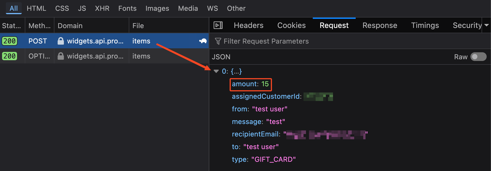

Attempting to enter invalid values in the frontend resulted in an error, preventing negative purchases and ensuring prices stayed between a range of $5 and $1,000. 

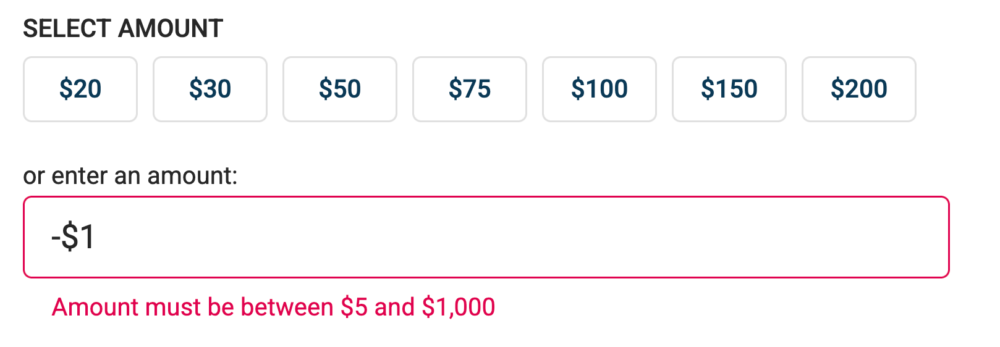

However, the backend was missing these checks. By replaying the request with a negative `amount`, namely `-15`, I was able to add a second gift card with a negative price to the cart. 

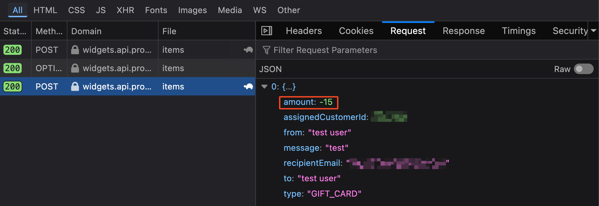

The result was two gift cards in the cart - one for $15.00 and another for -$15.00 - bringing the cart total to $0.00. Without a balance to be paid, the application allowed checkout to be completed and didn't prompt for payment details (common behavior for payment applications, allowing free items to be listed). 

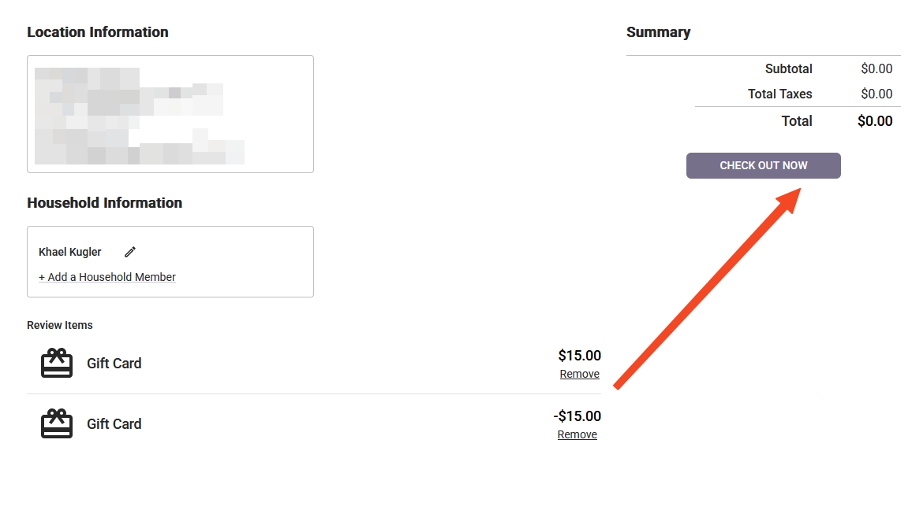

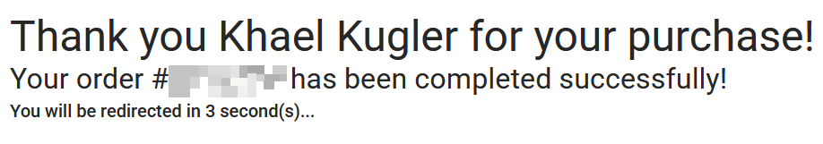

Both gift cards were provisioned and active, which I confirmed by applying the $15.00 gift card to a new cart containing a day pass. The resulting balance was reduced to $12.06. 

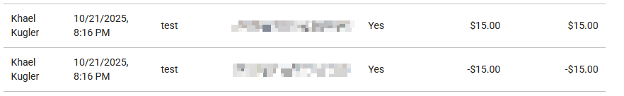

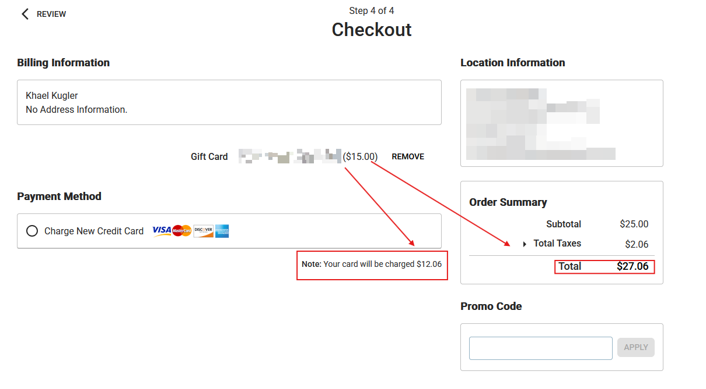

Furthermore, these illicit gift cards could be sent to other users via email, which would make it harder to trace where the cards originated from.

## Unlimited Day Passes

A similar issue existed with regular items. When adding a day pass to a cart, the request included a `quantity` field. 

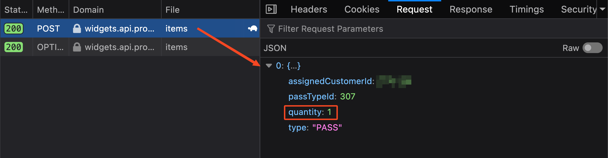

Again, the frontend blocked negative values, but the backend accepted them. By sending a second request with `quantity: -1`, the cart ended up with a $25.00 day pass and a -$25.00 day pass, once again totaling $0.00 and allowing checkout for free.

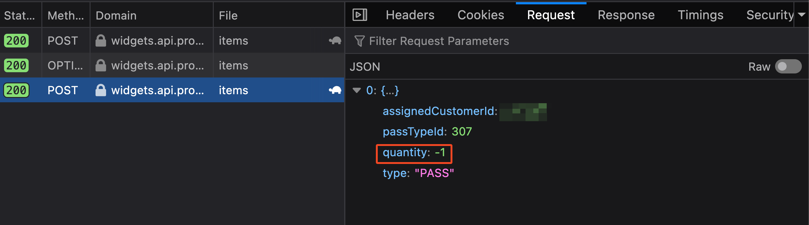

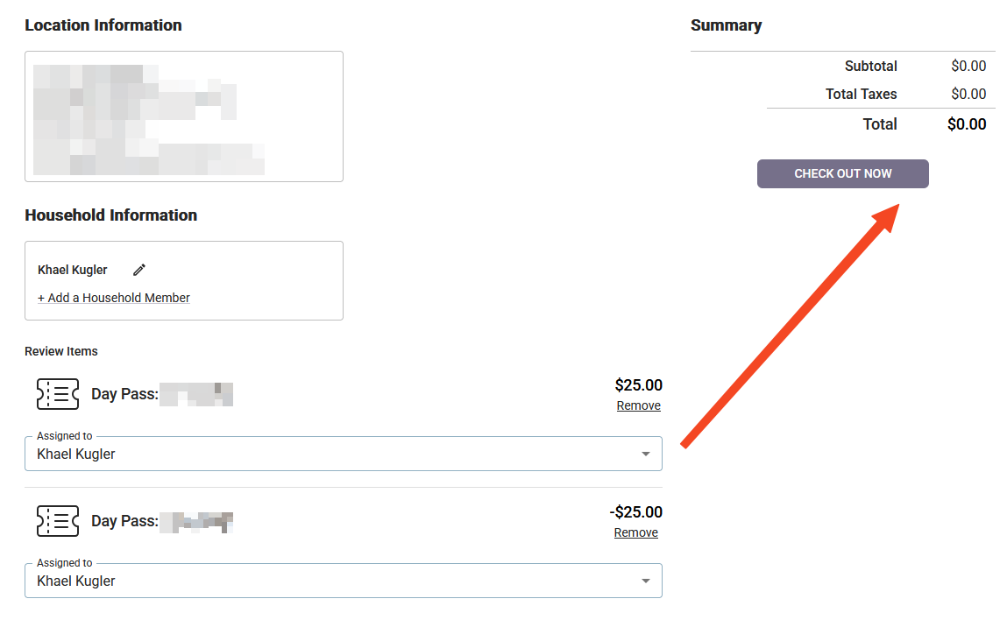

Funnily enough, it was even possible to add *more* negative items than positive ones, resulting in a negative cart balance. The application seemed to compensate for this by generating a negative gift card to cover the difference.

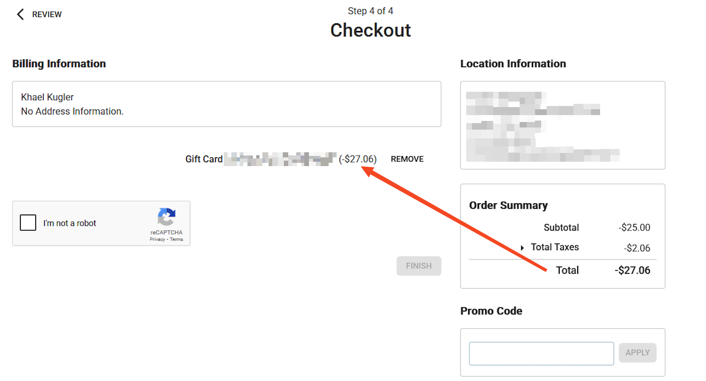

## What's the Haul?

A lot of free stuff. For context, Bouldering Project carries Scarpa and La Sportiva climbing shoes, which typically range from around $100 for beginner models up to $200+ for performance shoes like Scarpa Dragos or La Sportiva Solutions. They stock FrictionLabs chalk ($10-$30 depending on size), Organic Climbing chalk bags and buckets ($30-$68), skincare products, branded merch like shirts & hats, training tools like portable hangboards, and even crash pads for outdoor bouldering (which can run anywhere from $189 for an Organic Simple Pad to $339 for their 5" Thick Big Pad). They also sell food and drinks at the gym.

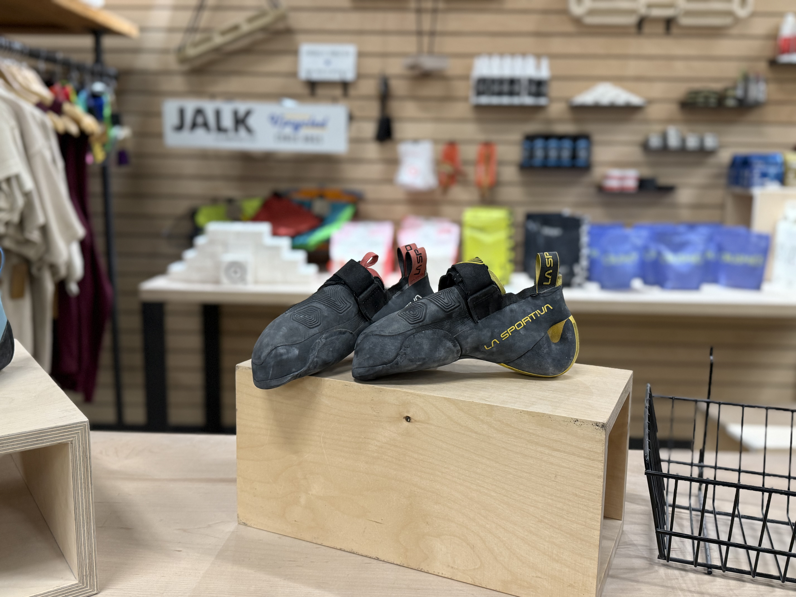

An attacker could generate gift cards in arbitrary amounts and use them to purchase any of these. You could outfit yourself (and anyone else) with a full climbing setup, from shoes to chalk and crash pads, without spending a dime. The potential for abuse scales as far as someone is willing to take it.

## The Upstream Impact

It's important to note that Approach.app isn't just used by Bouldering Project. A quick search for `site:tilefive.com` showed portals for a *ton* of climbing gyms - Bouldering Project, Crux, Vertex, and plenty of others. Every single one of these gyms was running the same vulnerable platform.

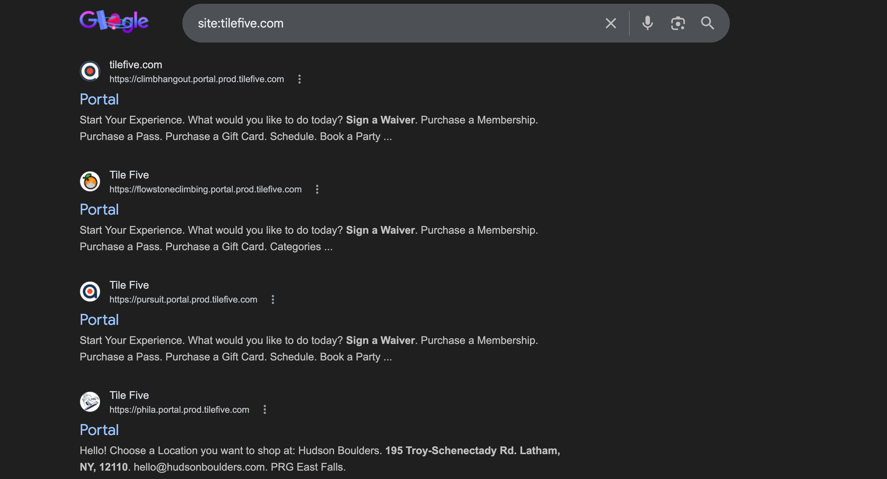

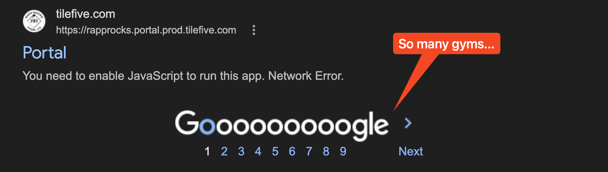

This excellently demonstrates the risk of upstream component compromise. One vulnerability in a shared third-party service resulted in exposure across every gym relying on it. 

Furthermore, detecting and responding to abuse of issues like these becomes increasingly difficult when the vulnerability lives in a third-party platform. Bouldering Project, for example, doesn't have control over the `tilefive.com` server, meaning they likely can't review logs or monitor for suspicious cart activity - they're entirely dependent on Tile Five to identify and remediate the issue.

## Takeaways

If you're building or maintaining an e-commerce platform (or really an application of any kind), always validate input server-side. This is a good example of [CWE-20: Improper Input Validation](https://cwe.mitre.org/data/definitions/20.html) - one of the most common and well-documented vulnerability classes out there. And if you're a business using a third-party service, consider their vulnerabilities to be your vulnerabilities. One flaw upstream can affect every customer downstream.