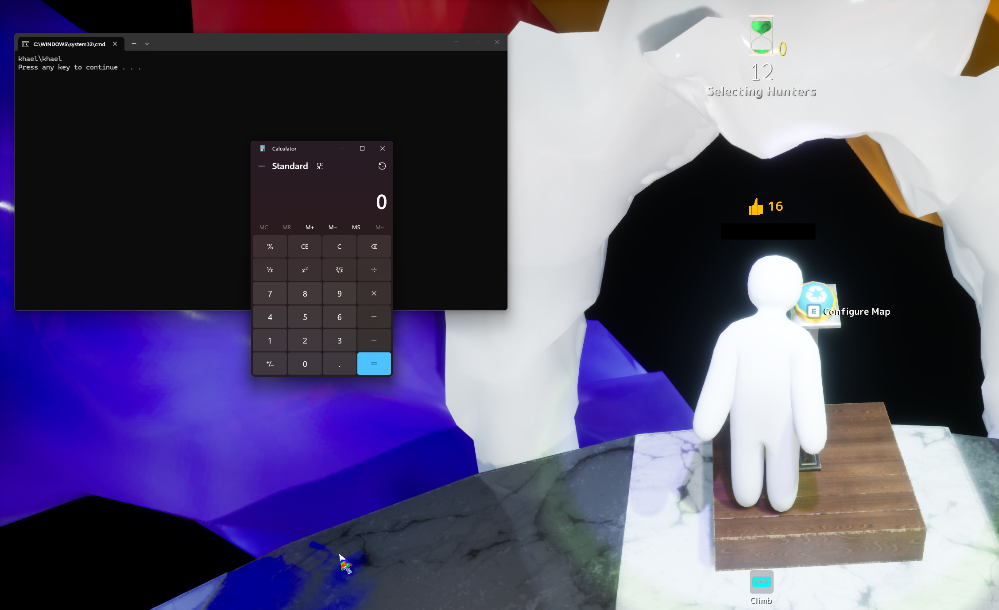

## Introduction

MECCHA CHAMELEON, a hide-and-seek game on Steam built with Unreal Engine 5, has been quite the rage recently. An indie game developer's dream: 7 million downloads (as of writing) without a single cent spent on advertising, and for good reason. It's a take on the classic prop hunt game, where players attempt to hide in a cluttered map from hunters, but with the added twist of being able to *literally* paint themselves into the scenery. For example, can you spot me below? I've added an arrow to help.

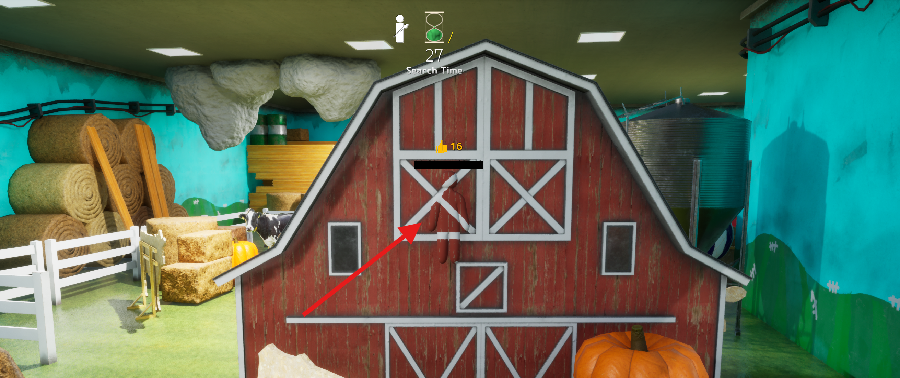

However, these types of indie games often sport rich attack surfaces, as we'll explore. 

## Custom Maps

One of the best parts of the game is the built-in support for custom maps. Without modding the game, players can create maps in UE5, package them into `.pak` files, and upload them to the Steam Workshop for others to play. 

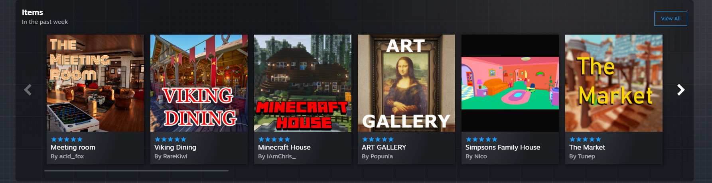

When a lobby host selects a custom map, all players are prompted to subscribe and download it before the game can start. Players will often pressure other players into downloading it, as the game cannot be started without players having downloaded the map.

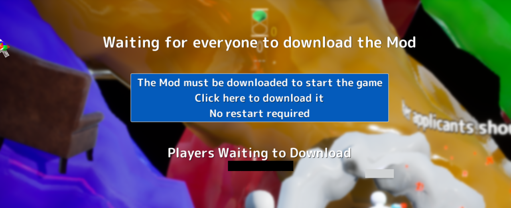

Crucially, though, workshop maps can contain more than just levels and textures. They can also include Blueprint logic - UE5's visual scripting system. Any Blueprint Actor placed in a map has its `BeginPlay` event fire automatically when the map loads on a client. This is standard behavior, used for things like animated doors or environmental effects, but it also means that any logic the map creator includes will execute on every player's machine. But what can actually be included in this logic?

## Digging into Blueprint Scripting & LaunchURL

Many of the functions available were pretty boring from a security perspective. Lighting changes, visual effects, along those lines. Python commands were actually made available, but only within the development environment - they wouldn't be executed in a deployed map.

One node did stand out, though: `LaunchURL`. At first glance, it seemed somewhat harmless - a function for opening URLs in the user's default browser. You could imagine a map creator using it to link to their social media or a Discord server.

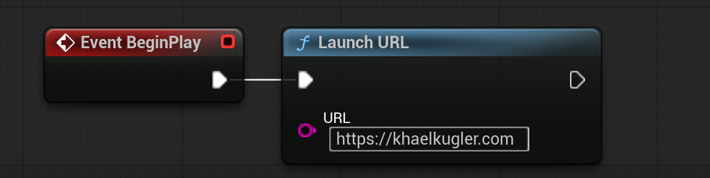

To understand what it actually did under the hood, I pulled the game's shipping binary (`PenguinHotel-Win64-Shipping.exe`) into Ghidra. The Blueprint-callable entry point, `UKismetSystemLibrary::execLaunchURL`, lives at `0x143e305e0`. Following the call chain, it goes through `LaunchURLFiltered`, `LaunchURL`, and eventually lands on `FWindowsPlatformProcess::LaunchURLInternal`, which calls `ShellExecuteW(NULL, "open", URL, NULL, NULL, SW_SHOWNORMAL)`.

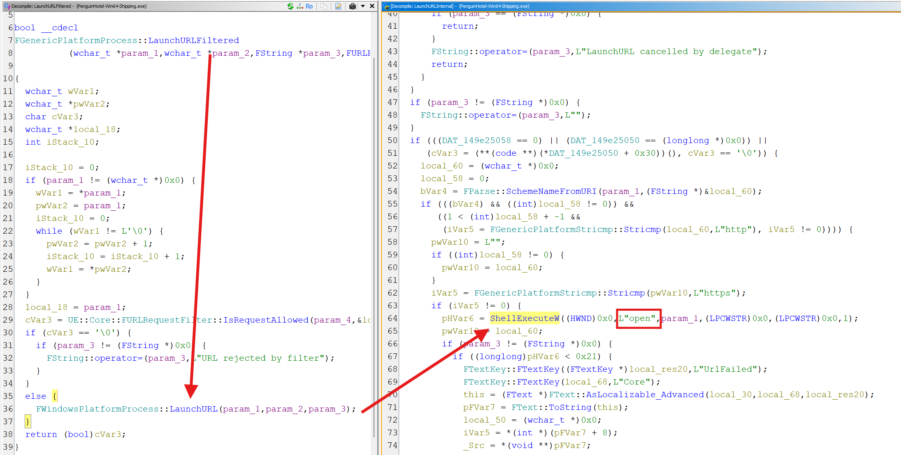

This immediately became a lot more interesting. `ShellExecuteW` with the `"open"` verb isn't just for web pages. It tells Windows to *launch* the path - similar to double-clicking a file, including executables.

However, as some of you may have noticed, we don't have argument control over the `ShellExecuteW` call - `lpParameters` is always NULL:

```
pHVar6 = ShellExecuteW((HWND)0x0,L"open",param_1,(LPCWSTR)0x0,(LPCWSTR)0x0,1)
```

Meaning something like `"cmd.exe", "/c whoami"` is off the table (and passing `"cmd.exe /c whoami"` would attempt to open the entire string as a path). This means running arbitrary commands requires somehow providing a malicious file, *with a valid file extension*, to the LaunchURL command.

The natural next thought is a UNC path - host a batch file on an attacker-controlled SMB share and pass `\\attacker\share\payload.bat`. Unfortunately, `LaunchURLInternal` only routes valid, non-HTTP/HTTPS schemes (like `file://` or `steam://`) to `ShellExecuteW`. UNC paths don't have a scheme, so they were routed to `LaunchWebURL` and opened in the browser. 

Thus, the question became: how do you plant a file on the victim's machine, at a path you know in advance?

## Arbitrary File Delivery

Lucky for me, Steam Workshop items (such as Maps) are essentially just folders. When a player uploads content, Steam intentionally allows every file type to be uploaded, leaving it up to the developer to restrict what files are mounted. Their documentation even calls this out, noting to developers that "your submission tool should accept just the file formats your game client expects to load." 

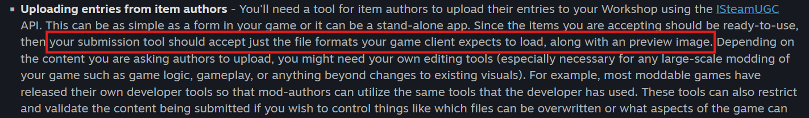

At the time, Meccha Chameleon performed no restrictions on uploaded file types. So let's just toss a file in the Map folder itself, and `LaunchURL` that path!

To pull this off, I needed a Workshop item ID first. Steam downloads Workshop content to a predictable path on every subscriber's machine - `C:\Program Files (x86)\Steam\steamapps\workshop\content\<app_id>\<workshop_id>\` - but you don't get an item ID until you've uploaded something. So the first step was uploading a benign map just to claim one.

After following many, many tutorials, I created a test map in UE5 and uploaded it.

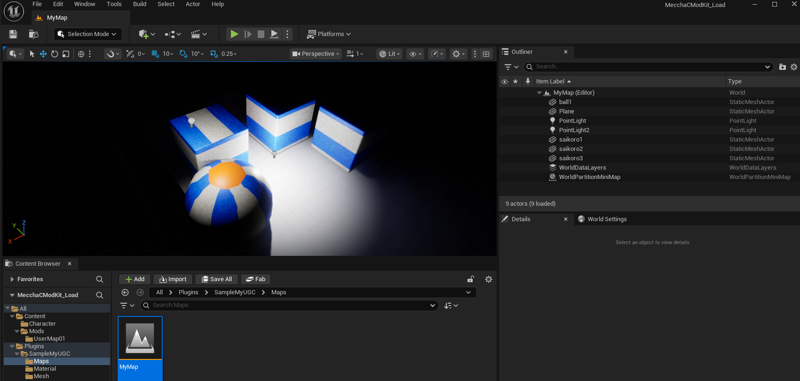

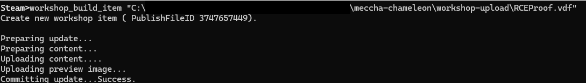

Steam assigned it ID `3747657449`. Combined with the game's AppID (`4704690`), this meant every subscriber would have the map's files at `C:\Program Files (x86)\Steam\steamapps\workshop\content\4704690\3747657449\`.

With the path known, I created `payload.bat` (simply running `whoami`) and dropped it in the upload folder next to the map's `.pak`, `.ucas`, and `.utoc` files. 

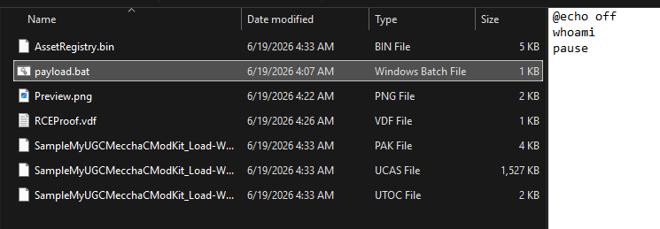

I updated the Blueprint's `BeginPlay` event to call `LaunchURL` with the full path and reuploaded the map.

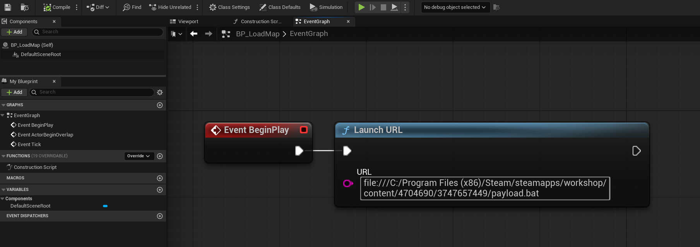
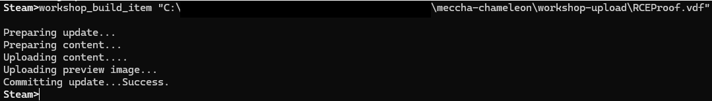

Time to test it out!

## Confirming Execution

I started by subscribing my own account to the map and hosting a lobby, selecting the map in the lobby settings. 

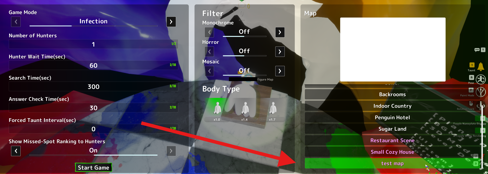

I joined the lobby with a second account and started the game as the host. My victim player in the lobby got the usual prompt to download the Map. Clicking through took them to the Steam Workshop page, prompting them to subscribe.

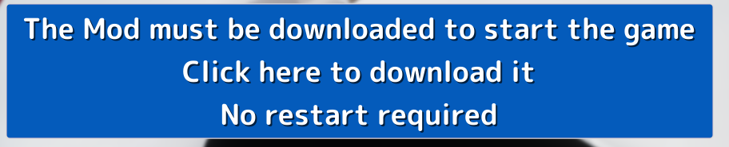
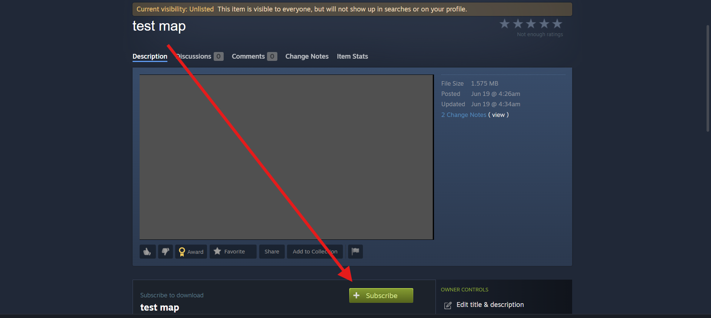

As soon as I clicked `Subscribe`, the map downloaded, `BeginPlay` fired, and `payload.bat` executed. A command prompt popped up with the output of `whoami`.

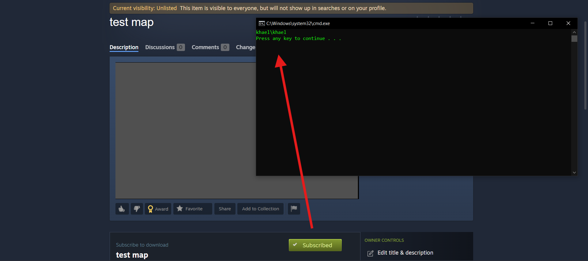

Two clicks - one on the map download prompt, and the other on `Subscribe` - and the attacker has arbitrary command execution on the victim's machine. The batch file could just as easily be a reverse shell, a malware dropper, or anything else. 

## Takeaways

This sort of attack seems to be somewhat prevalent within these types of games. Malicious Workshop content has been seen before, such as [Kaspersky's discovery of malicious Wallpaper Engine uploads](https://www.kaspersky.com/about/press-releases/kaspersky-discovered-a-malware-campaign-targeting-steam-users-through-infected-wallpaper). It's tough for developers to recognize what constitutes attacker-controlled data, and it's easy to assume that Steam handles the filtering.

If your game supports user-generated content, treat it as untrusted code - allowlist asset file types in Workshop uploads and restrict UE5 Blueprint usage. This vulnerability has been patched in the latest versions.